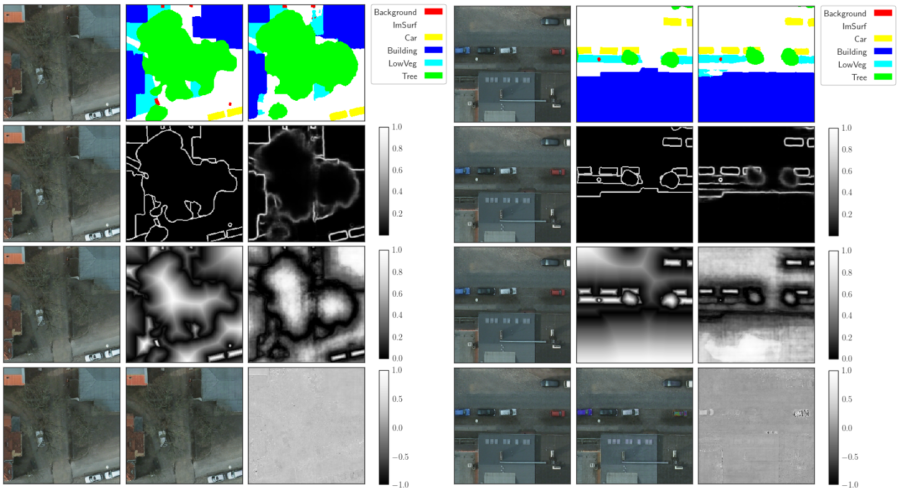

# ResUNet-a: a deep learning framework for semantic segmentation of remotely sensed data

This repository contains source code for some of the models used in the manuscript of the ([ResUNet-a](https://arxiv.org/abs/1904.00592)) paper. ResUNet-a is built with the [mxnet](https://mxnet.incubator.apache.org/) DL framework, under the gluon api. 




### Requirements
1. mxnet (latest version, tests run with mxnet_cu92-1.5.0b20190613)
2. opencv
3. rasterio
4. glob
5. pathos
6. [ISPRS Potsdam data](http://www2.isprs.org/commissions/comm3/wg4/2d-sem-label-potsdam.html) that should be appropriately preprocessed (slices of 256x256 patches). 


### Directory Structure

Complete models live in the ```models``` directory, specifically models d6 and d7 (conditioned multitasking). 
These are built from modules that are alive in ```resuneta/nn``` directory. The Tanimoto loss function (with complement) is defined in file ```resuneta/nn/loss/loss.py```  Inference demo (```.ipynb```) can be found in directory demo. Currently, we do not provide pre-trained weights (will do so in the immediate future). Directory ```nn``` contains all necessary modules for building resuneta models. Directort ```src``` is related to dataset definitions. In addition, file src/chopchop_run.py is an executable that produces slices of patches in size 256x256 from the original data. Please see the source code for modifications based on your directory structures. 

```
├── demo
├── images
├── models
├── nn
│   ├── BBlocks
│   ├── layers
│   ├── loss
│   ├── pooling
│   └── Units
└── src
```

### Example of model usage 
See also ```demo/*.ipynb```

```python
In [1]: from resuneta.models.resunet_d7_causal_mtskcolor_ddist import *
   ...: from mxnet import nd
   ...: 

In [2]: Nfilters_init = 32
   ...: NClasses = 6
   ...: net = ResUNet_d7(Nfilters_init,NClasses)
   ...: net.initialize()
   ...: 
depth:= 0, nfilters: 32
depth:= 1, nfilters: 64
depth:= 2, nfilters: 128
depth:= 3, nfilters: 256
depth:= 4, nfilters: 512
depth:= 5, nfilters: 1024
depth:= 6, nfilters: 2048
depth:= 7, nfilters: 1024
depth:= 8, nfilters: 512
depth:= 9, nfilters: 256
depth:= 10, nfilters: 128
depth:= 11, nfilters: 64
depth:= 12, nfilters: 32

In [3]: xx = nd.random.uniform(shape=[1,5,256,256]) 

In [4]: out = net(xx)
```


### License
CSIRO BSTD/MIT LICENSE

As a condition of this licence, you agree that where you make any adaptations, modifications, further developments, or additional features available to CSIRO or the public in connection with your access to the Software, you do so on the terms of the BSD 3-Clause Licence template, a copy available at: http://opensource.org/licenses/BSD-3-Clause.

### Citation
If you find the contents of this repository useful for your research, please cite: 

```
@article{DIAKOGIANNIS202094,
title = "ResUNet-a: A deep learning framework for semantic segmentation of remotely sensed data",
journal = "ISPRS Journal of Photogrammetry and Remote Sensing",
volume = "162",
pages = "94 - 114",
year = "2020",
issn = "0924-2716",
doi = "https://doi.org/10.1016/j.isprsjprs.2020.01.013",
url = "http://www.sciencedirect.com/science/article/pii/S0924271620300149",
author = "Foivos I. Diakogiannis and François Waldner and Peter Caccetta and Chen Wu",
keywords = "Convolutional neural network, Loss function, Architecture, Data augmentation, Very high spatial resolution"
}
```
